# Core Web Vitals (in simple terms)

Core Web Vitals are important checks from Google that show how users experience your website.  
They focus on speed, responsiveness, and stability.  

## 📊 The Three Core Web Vitals

1. **Loading speed**  
   - How fast the main content of your page shows up  
   - (so visitors don’t have to wait too long)

2. **Interactivity**  
   - How quickly your site reacts when someone clicks, taps, or types  

3. **Visual stability**  
   - How steady the page looks while loading  
   - (things shouldn’t jump or shift around suddenly)

---

## 🖼️ Mermaid Diagram

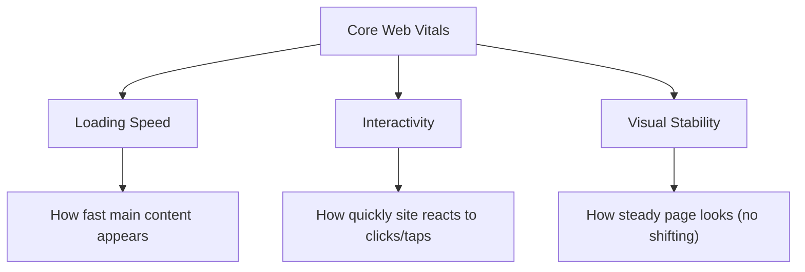

# 📌 Largest Contentful Paint (LCP)

## 🔎 What It Measures
- LCP checks **how fast the biggest part of your page** (like a main image, video, or headline text) shows up on the screen.  
- It’s about the **loading performance** that users actually feel.  

## ✅ Ideal Value
- **Good:** LCP should happen within **2.5 seconds** after the page starts loading.  
- **Needs Improvement:** Between **2.5s – 4s**.  
- **Poor:** More than **4 seconds**.  

---

## 🖼️ Mermaid Diagram

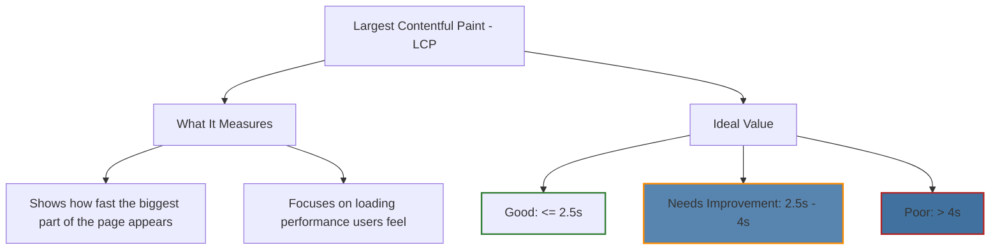

# 📌 First Input Delay (FID)

## 🔎 What It Measures
- FID checks **how quickly your site reacts** when a user first interacts with it.  
- Example: Clicking a button, tapping a link, or using a form.  

## ✅ Ideal Value
- **Good:** Less than **100 ms** (almost instant).  
- **Needs Improvement:** Between **100 – 300 ms**.  
- **Poor:** More than **300 ms** (feels slow or unresponsive).  

## ✅ Mermaid Diagram for FID

```mermaid
flowchart TD
    A[First Input Delay - FID] --> B[What It Measures]
    A --> C[Ideal Value]

    B --> B1[Measures site interactivity]
    B --> B2[Time for page to respond to first user action like a click]

    C --> D[Good: < 100 ms]
    C --> E[Needs Improvement: 100 - 300 ms]
    C --> F[Poor: > 300 ms]

    style D fill:#3B0404,stroke:#2E7D32,stroke-width:2px
    style E fill:#900020,stroke:#FF8C00,stroke-width:2px
    style F fill:#67595E,stroke:#B22222,stroke-width:2px
```

# 📌 Cumulative Layout Shift - CLS

## 🔎 What It Measures
- CLS checks the **visual stability** of your site.  
- It measures how much page content **moves or shifts** as the page loads.  
- Example: You try to click a button and an ad loads, pushing the button — that is a layout shift.

## ✅ Ideal Value
- **Good:** Less than **0.1** (stable).  
- **Needs Improvement:** **0.1 – 0.25**.  
- **Poor:** More than **0.25** (too jumpy).

```mermaid
flowchart TD
    A[Cumulative Layout Shift - CLS] --> B[What It Measures]
    A --> C[Ideal Value]

    B --> B1[Measures visual stability during page load]
    B --> B2[Tracks how much elements move or shift]

    C --> D[Good: < 0.1]
    C --> E[Needs Improvement: 0.1 - 0.25]
    C --> F[Poor: > 0.25]

    style D fill:#AA1945,stroke:#2E7D32,stroke-width:2px
    style E fill:#3B0918,stroke:#FF8C00,stroke-width:2px
    style F fill:#B8390E,stroke:#B22222,stroke-width:2px
```

# 📌 Field Data

## 🔎 Definition
- Field Data shows the **real-world performance** of your website.  
- It comes from **actual users** on different devices and networks, not just lab tests.  

## 🛠️ Source
- Collected from users who have visited your site.  
- Data comes from the **Chrome User Experience Report (CrUX)**, where users opt in to share performance data.  
- Covers a wide range of real-world conditions (slow/fast networks, mobile/desktop devices, etc.).  

## 📊 Metrics Included
- **Largest Contentful Paint (LCP):** How fast the largest element (image, video, text) becomes visible.  
- **First Input Delay (FID):** How quickly the page responds to the first user interaction.  
- **Cumulative Layout Shift (CLS):** How stable the page looks while loading.  

## ✅ Usefulness
- Gives insight into **how people actually experience your site**.  
- Helps identify performance problems that happen in the real world (like slow internet or weaker devices).

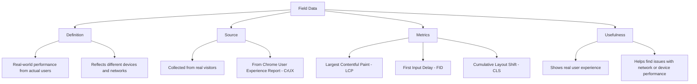

# 📌 Lab Data

## 🔎 Definition
- Lab Data refers to performance metrics collected in a **controlled environment**.  
- It uses simulated conditions (like fixed device types or internet speeds).  
- Generated by tools such as **Lighthouse** that run performance tests on a single device or virtual environment.  

## 🛠️ Source
- Collected through **automated tests** under predefined conditions.  
- These conditions can include specific network speeds, device settings, and browser environments.  

## 📊 Metrics
- **Performance Metrics:** First Contentful Paint (FCP), Speed Index, Time to Interactive (TTI), and more.  
- **Other Data:** Suggestions for optimizing resources, reducing load times, and improving overall performance.  

## ✅ Usefulness
- Provides a **consistent baseline** for testing performance.  
- Helps diagnose specific issues in a controlled setting.  
- Useful for **validating improvements** before pushing them live.  

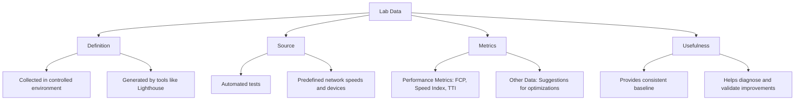

# 📌 Critical Rendering Path (CRP)

## 🔎 Definition
- The **Critical Rendering Path (CRP)** is the sequence of steps the browser follows to turn **HTML, CSS, and JavaScript** into a fully rendered webpage.  
- Optimizing the CRP is important because it directly affects **how fast a page becomes visible and usable** for visitors.  

## 🛠️ Steps in the Critical Rendering Path
1. **DOM Construction** – Building the structure of the page from HTML.  
2. **CSSOM Construction** – Building the style information from CSS.  
3. **Render Tree Construction** – Combining the DOM and CSSOM to figure out what each element should look like.  
4. **Layout (Reflow)** – Calculating the position and size of every element on the page.  
5. **Painting** – Filling pixels on the screen with colors, text, images, and borders.  
6. **Compositing** – Putting everything together into the final page for the user to see and interact with.  

```mermaid

flowchart TD
    A[Critical Rendering Path] --> B[DOM Construction]
    B --> C[CSSOM Construction]
    C --> D[Render Tree Construction]
    D --> E[Layout - Reflow]
    E --> F[Painting]
    F --> G[Compositing]
   ```

# 📌 First Contentful Paint (FCP)

## 🔎 Definition
- **FCP** measures the time it takes for a webpage to show the **first visible piece of content** (like text, image, or other elements) after a user opens it.  
- It matters because it shows **how quickly users start to see something happening**, which strongly impacts user experience and perceived performance.  

---

## ✅ Scoring
- **Good:** 1.8 seconds or less  
- **Needs Improvement:** 1.8s – 3.0s  
- **Poor:** 3.0s or more  

---

## ⚡ Key Factors Affecting FCP
- **Time to First Byte (TTFB)** – how fast the server responds.  
- **Network Latency** – delays caused by internet speed.  
- **JavaScript** – heavy scripts can block rendering.  
- **HTML Structure** – complex or inefficient markup slows rendering.  

---

## 🛠️ How to Improve FCP
- Eliminate render-blocking resources  
- Minify CSS  
- Remove unused CSS  
- Remove unused JavaScript  
- Preconnect to required origins  
- Reduce server response times (TTFB)  
- Avoid multiple page redirects  
- Preload key requests  
- Avoid enormous network payloads  
- Serve static assets with an efficient cache policy  
- Avoid an excessive DOM size  
- Minimize critical request depth  
- Ensure text remains visible during webfont load  
- Keep request counts low and transfer sizes small  

```mermaid

flowchart TD
    A[First Contentful Paint - FCP] --> B[Definition]
    A --> C[Scoring]
    A --> D[Key Factors]
    A --> E[Improvements]

    B --> B1[Time until first visible content appears]
    B --> B2[Shows how fast users see something on screen]

    C --> C1[Good: <= 1.8s]
    C --> C2[Needs Improvement: 1.8s - 3.0s]
    C --> C3[Poor: > 3.0s]

    D --> D1[Server response time - TTFB]
    D --> D2[Network latency]
    D --> D3[Heavy JavaScript]
    D --> D4[Complex HTML structure]

    E --> E1[Remove render-blocking resources]
    E --> E2[Minify & clean CSS/JS]
    E --> E3[Reduce TTFB & redirects]
    E --> E4[Preconnect & preload key requests]
    E --> E5[Optimize DOM size & payloads]
    E --> E6[Use efficient caching & font loading]
```

# 🌐 Serve Images in Next-Gen Formats  

  
  
  

**Serving images in next-gen formats** means using modern image formats like **WebP** and **AVIF** instead of older ones such as **JPEG** or **PNG**.  
These formats provide **better compression** and **high-quality visuals** with **smaller file sizes**, which improves **page load speed** and **user experience**.  

---

## ✅ Benefits
- ⚡ Faster page loading  
- 📉 Reduced bandwidth usage  
- 🔍 Better SEO and Core Web Vitals  
- 🎨 Maintains visual quality  

---

## 🖼️ Example Formats  

| Format | Benefits | Browser Support |
|--------|----------|-----------------|
| **WebP** | ~25-35% smaller than JPEG, supports transparency and animation | Widely supported |
| **AVIF** | Higher compression efficiency than WebP, excellent quality | Growing support (latest Chrome, Firefox, Safari) |

---

## 💻 Code Example  

```html
<!-- Copy Code 👇 -->
<picture>
  <source srcset="image.avif" type="image/avif">
  <source srcset="image.webp" type="image/webp">
  
</picture>
```

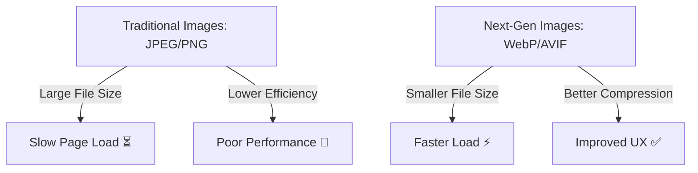

# 📌 Serve Images in Next-Gen Formats

## 🔎 Definition
- Serving images in **next-gen formats** means using modern image types that are **smaller in size but keep high quality**, compared to older formats like JPEG or PNG.  
- These formats help web pages load faster and improve the user experience.  

---

## 🌟 Recommended Formats
- **WEBP** – Offers better compression than JPEG/PNG, with wide browser support.  
- **AVIF** – Even smaller file sizes and higher quality, but newer and not supported in all browsers yet.  

---

## ✅ Benefits
- Faster page load times 🚀  
- Reduced bandwidth usage 📉  
- Better user experience 😃  
- Improved Core Web Vitals (especially **LCP**)  

---

## 🛠️ Best Practices
- Use **WebP** as the default for broad support.  
- Provide **AVIF** where supported for maximum optimization.  
- Keep fallback formats (like JPEG/PNG) for older browsers.  
- Automate conversion using tools like **ImageMagick**, **Squoosh**, or build pipelines (e.g., webpack, gulp, Next.js Image Optimization).  

```mermaid

flowchart TD
    A[Images on Website] --> B[Next-Gen Formats]
    B --> C[WEBP - Broad support]
    B --> D[AVIF - Smaller size, better quality]
    B --> E[Fallback - JPEG/PNG]

    style B fill:#020821,stroke:#ffffff,stroke-width:2px
    style C fill:#000C66,stroke:#ffffff
    style D fill:#274472,stroke:#ffffff
    style E fill:#16796F,stroke:#ffffff
```

# 📌 Defer Offscreen Images

## 🔎 Definition
- **Deferring offscreen images** means delaying the loading of images that are **not immediately visible** on the user’s screen.  
- This improves performance by letting the browser focus on **critical content first**, making the site load faster and feel more responsive.  

---

## ✅ Benefits
- Faster initial page load 🚀  
- Reduced unnecessary network usage 📉  
- Better Core Web Vitals (especially **LCP** and **FCP**)  
- Smoother browsing experience for users 😃  

---

## 🛠️ How to Defer Offscreen Images

### 1. Implement Lazy Loading  
- Add the `loading="lazy"` attribute to `` elements **outside the initial viewport**.  
```html

```

### 2. Use Responsive Images 

```html

```

### 3. Use the <picture> Element

```htm
<picture>
  <source srcset="image.avif" type="image/avif">
  <source srcset="image.webp" type="image/webp">
  
</picture>
```


---

### 🖼️ Optional Mermaid Diagram (Workflow)

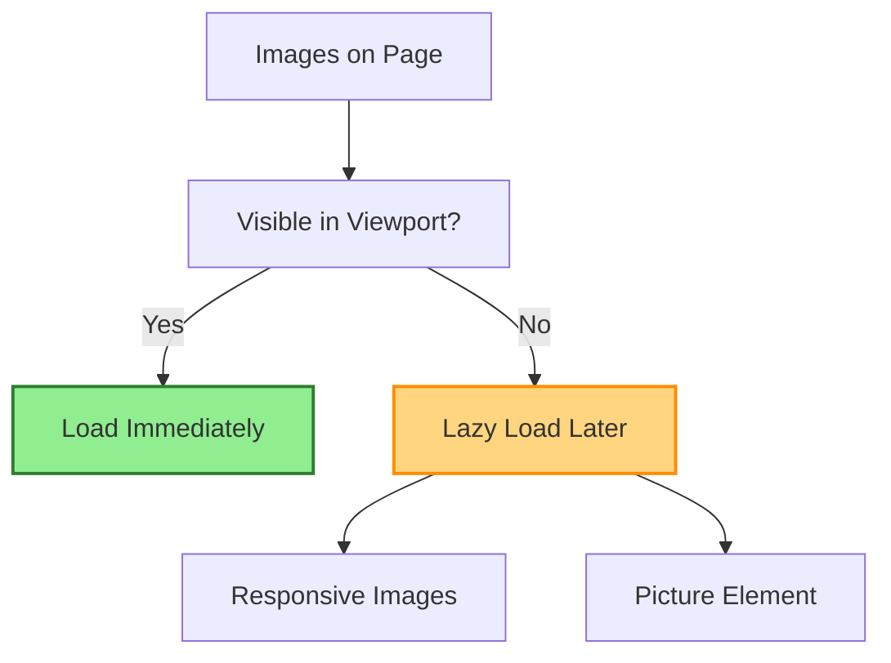
# 📌 Ensure Text Remains Visible During Webfont Load

## 🔎 Problem
- Web fonts are often large and can take time to load.  
- Some browsers hide text until the font is fully loaded, causing a **Flash of Invisible Text (FOIT)**.  
- This creates a poor user experience where users see blank spaces instead of text.  

---

## ✅ Solution
Use the **`font-display` property** to control how fonts are shown while loading.  
This allows the browser to display fallback system fonts first, then swap them with the custom font when ready.  

---

## ⚡ Common `font-display` Values
- **`swap`** → Immediately shows fallback text, then swaps in the custom font.  
- **`fallback`** → Shows fallback quickly, swaps if font loads soon.  
- **`optional`** → Uses fallback if font loads too slowly (best for performance).  

---

## 🛠️ Implementation

### CSS Example
```css
@font-face {
  font-family: 'Pacifico';
  font-style: normal;
  font-weight: 400;
  src: local('Pacifico Regular'), local('Pacifico-Regular'),
       url(https://fonts.gstatic.com/s/pacifico/v12/FwZY7-Qmy14u9lezJ-6H6MmBp0u-.woff2)
       format('woff2');
  font-display: swap;
}
```

## 🌟 Benefits

- Prevents invisible text during font load.
- Improves First Contentful Paint (FCP).
- Provides a better reading experience for users on slow networks.


---

### 🖼️ Optional Mermaid Diagram (Font Loading Flow)

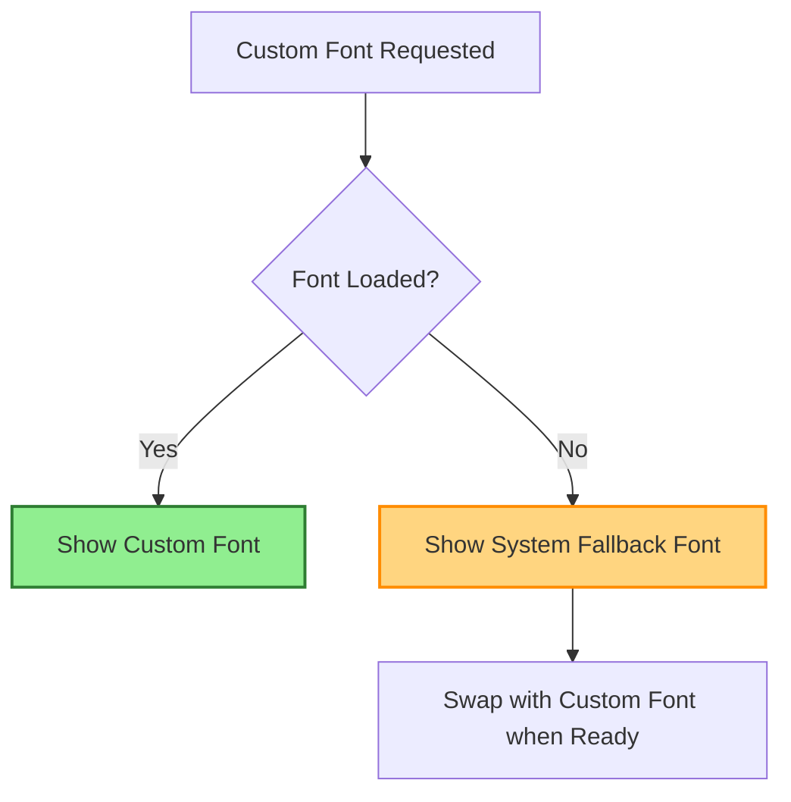

# 📌 Avoid Excessive DOM Size

## 🔎 Definition
- The **DOM (Document Object Model)** is the structure of elements on a webpage.  
- An **excessively large DOM** (too many HTML nodes) can hurt performance by:  
  - Slowing page load time  
  - Increasing memory usage  
  - Making rendering less efficient  

---

## ⚠️ How a Large DOM Slows Your Website

### 1. ⏳ Network Efficiency & Load Performance
- Extra nodes that aren’t visible still get loaded.  
- Increases **data usage** and **slows page load time** unnecessarily.  

### 2. ⚡ Runtime Performance
- The browser constantly **recalculates layout and styles** as users interact with the page.  
- A **large DOM + complex CSS** = sluggish rendering and scrolling.  

### 3. 🧠 Memory Performance
- Broad JavaScript selectors like `document.querySelectorAll('li')` may grab **thousands of nodes at once**.  
- This can overwhelm memory on **low-end devices**.  

---

## 📊 Lighthouse Thresholds
- ⚠️ **Warning:** More than **800 nodes** in `<body>`.  
- ❌ **Error:** More than **1,400 nodes** in `<body>`.  

---

## 🛠️ How to Optimize DOM Structure

### ✅ Simplify the DOM
- Reduce unnecessary wrappers (`<div>` inside `<div>`).  
- Avoid deeply nested structures.  

### ✅ Use Semantic HTML
- Use HTML5 semantic tags like `<header>`, `<footer>`, `<section>`, `<article>` instead of multiple `<div>`s.  

### ✅ Minimize Dynamic DOM Manipulation
- Avoid creating too many nodes dynamically with JavaScript.  
- Reuse existing nodes where possible.  

### ✅ Avoid Overuse of Libraries
- Some libraries add extra markup (e.g., multiple wrapper `<div>`s).  
- Only include what’s necessary.  

### ✅ Monitor and Analyze
- Use Chrome DevTools, Lighthouse, or WebPageTest to track DOM size.  

### ✅ Clean Up Unused Elements
- Remove elements that don’t contribute to visible content or functionality.  

---

## 🌟 Benefits
- Faster **page load times** 🚀  
- Smoother **rendering and scrolling** 🖥️  
- Lower **memory usage** 📉  
- Better **Core Web Vitals (FCP, INP, CLS)** ✅  

---

## 🖼️ Mermaid Diagram (Excessive DOM Impact)

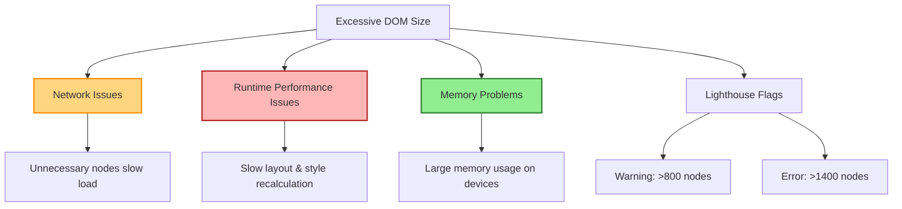

# 📌 Avoid Chaining Critical Requests

## 🔎 Definition
- **Critical request chaining** happens when resources load in a sequence, where one file **depends on another** before it can start.  
- Example:  
  - HTML → CSS → JS → Image → Font  
- Each dependency adds **delay**, slowing down how quickly the page renders.  

---

## ⚠️ Why It’s a Problem
- Longer dependency chains = **slower page load times** ⏳  
- Delays in **First Contentful Paint (FCP)** and **Largest Contentful Paint (LCP)**  
- Poorer user experience due to late rendering  

---

## 🛠️ How to Avoid Chaining Critical Requests
- **Minimize dependencies** between files (avoid requiring multiple steps).  
- **Inline critical CSS** (load essential CSS directly in the HTML).  
- **Defer or async JavaScript** so it doesn’t block rendering.  
```html
<script src="script.js" defer></script>
<script src="script.js" async></script>
```

- Preload important resources (fonts, images, CSS).
```html
<link rel="preload" href="styles.css" as="style">
```

##🌟 Benefits

- Faster rendering of above-the-fold content 🚀
- Improved Core Web Vitals (LCP & FCP) ✅
- Better overall user experience 😃

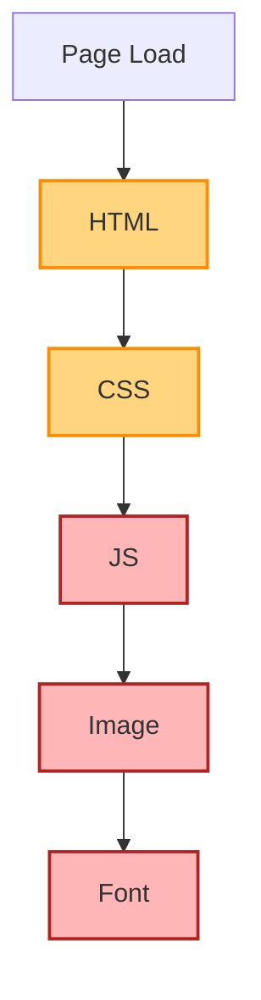
