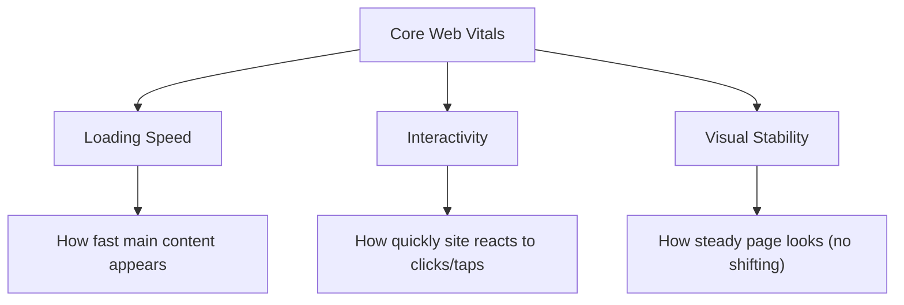
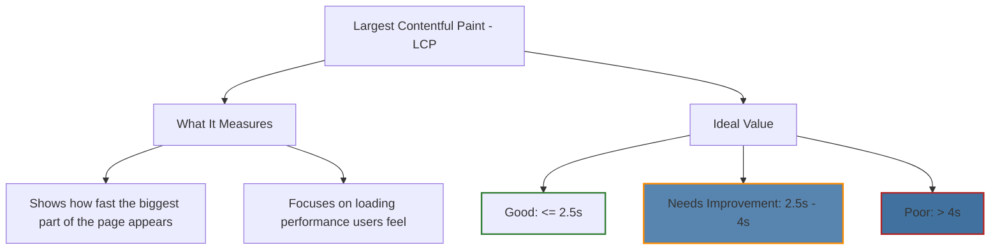

# Core Web Vitals (in simple terms)

Core Web Vitals are important checks from Google that show how users experience your website.  
They focus on speed, responsiveness, and stability.  

## 📊 The Three Core Web Vitals

1. **Loading speed**  
   - How fast the main content of your page shows up  
   - (so visitors don’t have to wait too long)

2. **Interactivity**  
   - How quickly your site reacts when someone clicks, taps, or types  

3. **Visual stability**  
   - How steady the page looks while loading  
   - (things shouldn’t jump or shift around suddenly)

---

## 🖼️ Mermaid Diagram

# 📌 Largest Contentful Paint (LCP)

## 🔎 What It Measures
- LCP checks **how fast the biggest part of your page** (like a main image, video, or headline text) shows up on the screen.  
- It’s about the **loading performance** that users actually feel.  

## ✅ Ideal Value
- **Good:** LCP should happen within **2.5 seconds** after the page starts loading.  
- **Needs Improvement:** Between **2.5s – 4s**.  
- **Poor:** More than **4 seconds**.  

---

## 🖼️ Mermaid Diagram

# 📌 First Input Delay (FID)

## 🔎 What It Measures
- FID checks **how quickly your site reacts** when a user first interacts with it.  
- Example: Clicking a button, tapping a link, or using a form.  

## ✅ Ideal Value
- **Good:** Less than **100 ms** (almost instant).  
- **Needs Improvement:** Between **100 – 300 ms**.  
- **Poor:** More than **300 ms** (feels slow or unresponsive).  

## ✅ Mermaid Diagram for FID

```mermaid
flowchart TD
    A[First Input Delay - FID] --> B[What It Measures]
    A --> C[Ideal Value]

    B --> B1[Measures site interactivity]
    B --> B2[Time for page to respond to first user action like a click]

    C --> D[Good: < 100 ms]
    C --> E[Needs Improvement: 100 - 300 ms]
    C --> F[Poor: > 300 ms]

    style D fill:#3B0404,stroke:#2E7D32,stroke-width:2px
    style E fill:#900020,stroke:#FF8C00,stroke-width:2px
    style F fill:#67595E,stroke:#B22222,stroke-width:2px
```

# 📌 Cumulative Layout Shift - CLS

## 🔎 What It Measures
- CLS checks the **visual stability** of your site.  
- It measures how much page content **moves or shifts** as the page loads.  
- Example: You try to click a button and an ad loads, pushing the button — that is a layout shift.

## ✅ Ideal Value
- **Good:** Less than **0.1** (stable).  
- **Needs Improvement:** **0.1 – 0.25**.  
- **Poor:** More than **0.25** (too jumpy).

```mermaid
flowchart TD
    A[Cumulative Layout Shift - CLS] --> B[What It Measures]
    A --> C[Ideal Value]

    B --> B1[Measures visual stability during page load]
    B --> B2[Tracks how much elements move or shift]

    C --> D[Good: < 0.1]
    C --> E[Needs Improvement: 0.1 - 0.25]
    C --> F[Poor: > 0.25]

    style D fill:#AA1945,stroke:#2E7D32,stroke-width:2px
    style E fill:#3B0918,stroke:#FF8C00,stroke-width:2px
    style F fill:#B8390E,stroke:#B22222,stroke-width:2px
```

